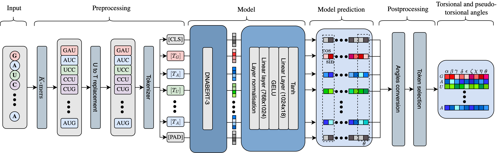

# RNA-TorsionBERT

`RNA-TorsionBERT` is a 331 MB parameter BERT-based language model that predicts RNA torsional and pseudo-torsional angles from the sequence.

`RNA-TorsionBERT` is a DNABERT model that was pre-trained on ~4200 RNA structures before being fine-tuned on 185 non-redundant structures from rsRNASP.

It provides an improvement of MAE of 6.2° over the previous state-of-the-art model, SPOT-RNA-1D, on the Test Set (composed of RNA-Puzzles and CASP-RNA).

| Model  | $\alpha$ | $\beta$  | $\gamma$  | $\delta$  | $\epsilon$  | $\zeta$  | $\chi$  | $\eta$  | $\theta$  | 
|------------------|----------|------|------|------|------|------|------|------|------| 
| **RNA-TorsionBERT**  | 37.3     | 19.6 | 29.4 | 13.6 | 16.6 | 26.6 | 14.7 | 20.1 | 25.4 | 
| SPOT-RNA-1D        | 45.7     | 23   | 33.6 | 19   | 21.1 | 34.4 | 19.3 | 28.9 | 33.9 | 

