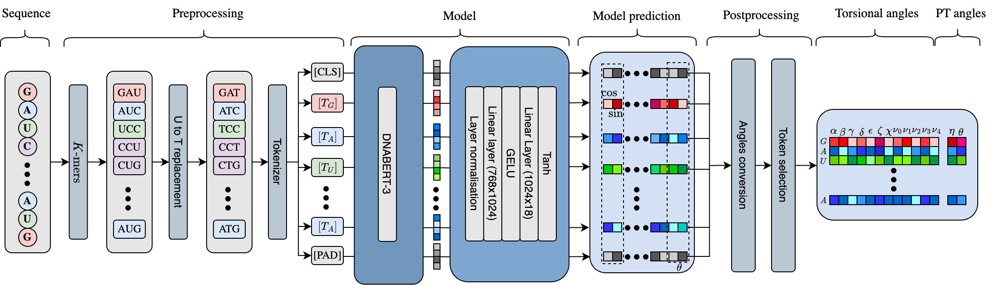

# RNA-TorsionBERT

`RNA-TorsionBERT` is a 86.9 MB parameter BERT-based language model that predicts RNA torsional and pseudo-torsional angles from the sequence.




`RNA-TorsionBERT` is a DNABERT model that was pre-trained on ~4200 RNA structures.

It provides improvement of [MCQ](https://github.com/tzok/mcq4structures) over the previous state-of-the-art models like 
[SPOT-RNA-1D](https://github.com/jaswindersingh2/SPOT-RNA-1D) or inferred angles from existing methods, on the Test Set (composed of RNA-Puzzles and CASP-RNA).

## Installation

To install RNA-TorsionBERT and it's dependencies following commands can be used in terminal:

```bash
pip install -r requirements.txt 
```


## RNA-TorsionBERT usage

To run the RNA-TorsionBERT, you can use the following command line:
```bash
python -m src.rna_torsionBERT_cli [--seq_file] [--in_fasta] [--out_path]
```

The arguments are the following:
- `--seq_file`: RNA Sequence. 
- `--in_fasta`: Path to the input sequence fasta file. 
- `--out_path`: Path to a `.csv` file where the output will be saved. 

You can also import in your python code the class `RNATorsionBERTCLI` from `src.rna_torsionBERT_cli`. 


## TB-MCQ

TB-MCQ stands for TorsionBERT-MCQ, which is a scoring function to assess the quality of a predicted structure in torsional angle space.
Given the inferred angles from the structures and the predicted angles from the model, TB-MCQ computes the quality of the predicted angles using 
the [MCQ](https://github.com/tzok/mcq4structures) (mean of circular quantities) metric.


To run the TB-MCQ scoring function, you can use the following command line:
```bash
python -m src.rna_torsion_cli [--in_pdb] [--out_path]
```
with:

- `--in_pdb`: Path to the input PDB file.
- `--out_path`: Path to a .csv file where the output will be saved.


## Docker 
To run the code using `Docker`, you can use the following command line:
```bash
docker build -t rna_torsionbert .
docker run -it rna_torsionbert 
```

It will enter into a bash console where you could execute the previous commands with all the installations done. 

To have example of commands, you can look at the `Makefile`.


## Citation

```bibtex
@article{rna_torsion_bert,
    author = {Bernard, Clément and Postic, Guillaume and Ghannay, Sahar and Tahi, Fariza},
    title = {RNA-TorsionBERT: leveraging language models for RNA 3D torsion angles prediction},
    journal = {Bioinformatics},
    volume = {41},
    number = {1},
    pages = {btaf004},
    year = {2025},
    month = {01},
    issn = {1367-4811},
    doi = {10.1093/bioinformatics/btaf004},
    url = {https://doi.org/10.1093/bioinformatics/btaf004},
    eprint = {https://academic.oup.com/bioinformatics/article-pdf/41/1/btaf004/61381586/btaf004.pdf},
}
```
